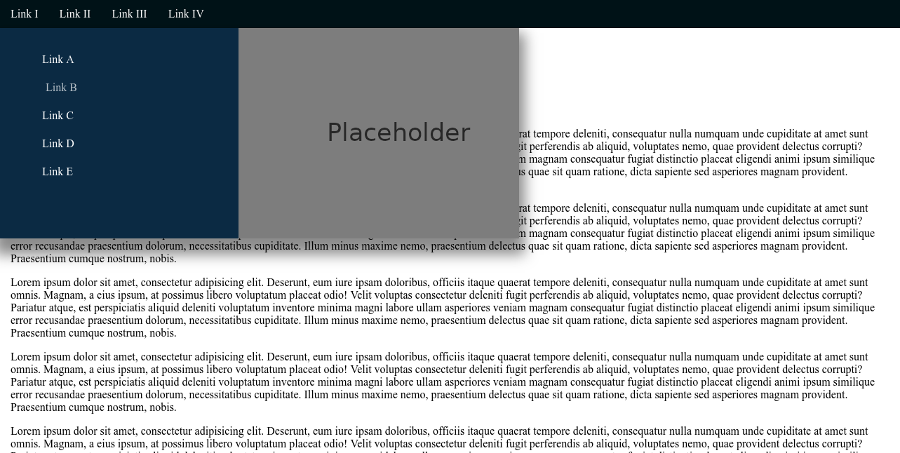
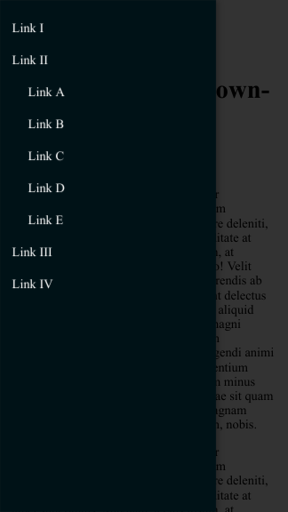

# CSS-Responsive-Navigation

**CSS only!**

> Here you can find the [demo version](https://peter-stuhlmann-webentwicklung.de/projects/css-responsive-dropdown-navigation/ "Forwarding to external website") of this project. 

## Desktop version with dropdown (hover)

## Mobile version Toggle button

")

## Mobile version Navigation

> Here you can find the [demo version](https://peter-stuhlmann-webentwicklung.de/projects/css-responsive-dropdown-navigation/ "Forwarding to external website") of this project.